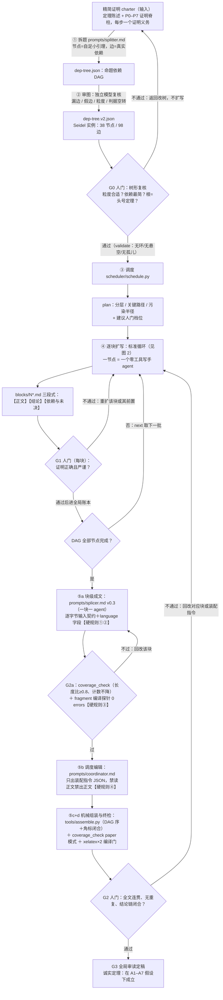
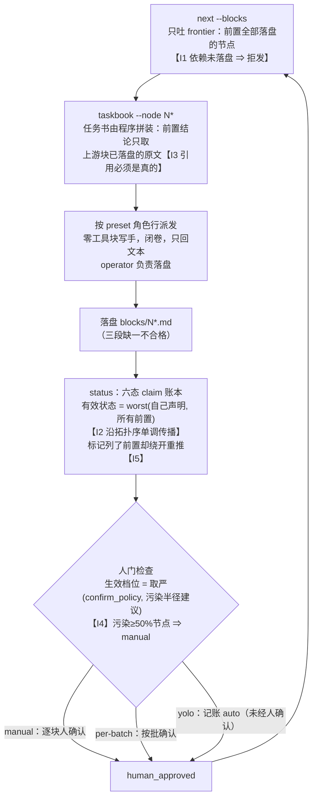

# Phase 2 工作流图解（给老师看的一页）

> 二期问的问题：**能否把一篇长证明分块写出来，再拼成一篇论文？**
> （只测拼接级/工程级质量，不产生 A/B 分数，不与一期统计混用。）

## 图 1：端到端总流程（五步 + 四个人门）



## 图 2：逐块扩写的标准循环（调度器五不变量在哪一步强制）



配套的六态严重度序（账本用语，从好到坏）：

`PROVED-IN-PROJECT` → `IMPORTED-VERIFIED` → `CONDITIONAL` → `FIXED` → `CANDIDATE` → `BLOCKED`

## 图 3：块写手的上下文（四进三出 + 三层策略）

```mermaid
flowchart LR
    subgraph IN["四进（局部上下文，全树共用的接口）"]
        I1["① 全局约定卡（精简版）<br/>符号/记号/命名，全树唯一"]
        I2["② 前置结论摘要<br/>上游块已落盘的原文引用句"]
        I3["③ 允许依赖<br/>外部定理的精确陈述，无名号无证明"]
        I4["④ 本块义务<br/>objective + completion test"]
    end
    subgraph OUT["三出（三段缺一不合格）"]
        O1["【正文】只写本块<br/>不复述背景、不重复全局约定"]
        O2["【结论】一句可被下游直接引用<br/>句末带六态标注"]
        O3["【依赖与未决】引用了哪些前置<br/>新局部符号 + 最小 blocker"]
    end
    IN --> W["零工具块写手 agent<br/>闭卷、单上下文"] --> OUT
    X["论文其余部分 / 全文 / 上游正文<br/>（detail_deps 点名的构造级依赖除外）"] -.-"✗ 永不进入块写手（splicer 的特权）".-> W
```

三层上下文策略（下层能看多少上层）：

| 层 | 内容 | 何时给 |
|---|---|---|
| 1 | 直接 deps 的【结论】（完整引理陈述） | 永远给 |
| 2 | `detail_deps` 点名前置的【正文】 | 构造级依赖才给（如需合成映射） |
| 3 | 全文 | 永不给——N37 全部祖先正文约 55k tokens，且模型会复述上游、上游一错全体返工 |

## 为什么这样设计（一段话版）

长论文不放进一个上下文里写。一次性写成整篇会跳步、注意力稀释、上下文堆积；拆开后每个小引理在一个干净上下文里闭卷扩写，成本几乎不增（多轮迭代下实打实省 token），省的是上下文控制与质量。Seidel 的 38 节点依赖结构是 DAG 而不是树——25 个节点被两个以上下游引用（引理复用），所以必须由调度器保证各处看到同一份结论。**成文层同理不整篇一次成型**（v1"整体拼接编辑"已实证降质）：每块先成局部 LaTeX fragment（S1），调度编辑只出装配指令（S2），机械代码组装并过覆盖断言与编译门（S3/S4）；符号与角标一致由全局约定卡＋装配指令＋组装器共同保证。上一轮教训（6 块只成 1 块，N19 "假设前置成立"把证明写完）催生了调度器五不变量：**这类事故在机械上不可能再发生**。Seidel 是 open problem，预期大量 BLOCKED 而非完整证明——报 BLOCKED + 最小 blocker + 能证到的最强结论，比编造有价值；`status` 会诚实传播到 headline，最终定理写成"在 A1–A7 假设下成立"。

## Seidel 实测形状与当前进度（2026-08-20）

- 38 节点 / 98 边（v2 审图后）；串行深度 24 层，最宽 3，理论最优加速比仅 **1.58x** ⇒ 优先级是正确性而非吞吐。
- 污染半径 top：N01/N00=36、N02=35、N03=34 ⇒ **前 7 层全部 manual**（人工介入产出比最高的位置）。
- 当前进度（2026-08-20 收）：**全链首次全绿**——38/38 块（P0–P7 全收官、零 I3、I5 全过）→ S1 38/38 fragments（coverage＋探针全 PASS）→ S2 组装 ok → S4 编译门 0 errors（**paper.pdf 70 页**，长度比 3.09 零丢失）。S3 格式审查待 operator 裁决（QUESTIONS.md 五族）；旧 splice-v1 拼接链与 v1 编辑稿已归档（`runs/archive/seidel-superseded-20260820/`）。
